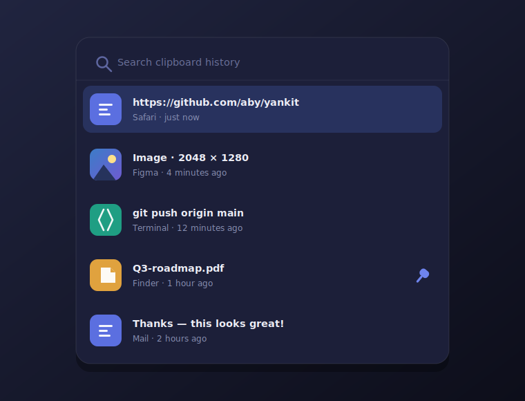
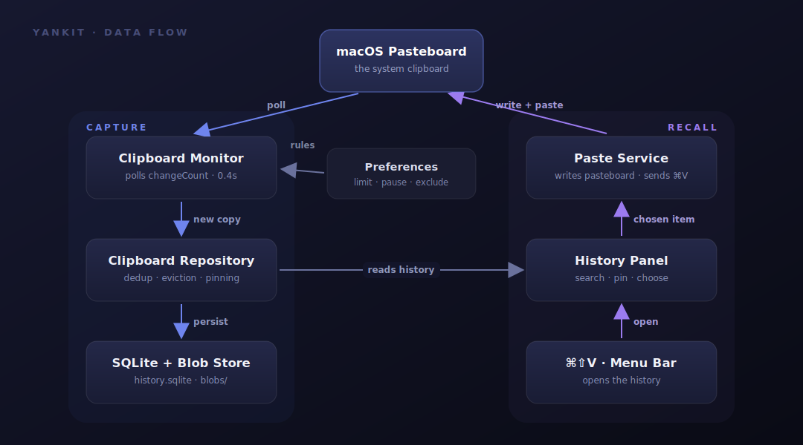

<p align="center">
  
</p>

<p align="center">
  
  
  
  
  
</p>

<p align="center">
  A fast, free, open-source clipboard manager for macOS —<br>
  it remembers the <b>text</b>, <b>images</b>, and <b>files</b> you copy, and pastes any of them back with <b>⌘⇧V</b>.
</p>

<p align="center">
  <a href="#features">Features</a> &nbsp;·&nbsp;
  <a href="#a-look-inside">A look inside</a> &nbsp;·&nbsp;
  <a href="#how-it-works">How it works</a> &nbsp;·&nbsp;
  <a href="#build-and-run">Build</a> &nbsp;·&nbsp;
  <a href="#keyboard-shortcuts">Shortcuts</a> &nbsp;·&nbsp;
  <a href="#roadmap">Roadmap</a>
</p>

---

## Features

- **Captures everything you copy** — plain text, images, and files, automatically.
- **Searchable history** — press ⌘⇧V, start typing, and the list filters instantly.
- **Pin what matters** — pinned items are exempt from the rolling limit and never auto-deleted.
- **Paste straight back** — pick an item and Yankit pastes it into the app you were just in.
- **Prune on the fly** — delete any single item with the row's × button or ⌘⌫.
- **Light on memory** — history lives in SQLite with image blobs on disk, not in RAM (~40 MB idle).
- **Privacy-first** — skips password-manager content, dims while paused, and keeps its data out of Spotlight and Time Machine.
- **Pause when you need to** — one click silences capture for an hour, until tomorrow, or until you resume.
- **Per-app exclusion** — tell Yankit to ignore copies made in specific apps.
- **Yours to tune** — a configurable cap (default 30) trims the oldest items, with optional auto-expiry by age.

## A look inside

Press `⌘⇧V` anywhere and the history panel drops in, centered and ready — search,
arrow keys, Return to paste.

<p align="center">
  
</p>

## How it works

Yankit lives in the menu bar — no Dock icon, no window in your way. A lightweight
monitor watches the system pasteboard and records each new copy into a local
SQLite database, with image and file payloads stored as files on disk so the
database stays small and fast. When you pick an item, it goes back on the
pasteboard and Yankit pastes it into wherever you were.

<p align="center">
  
</p>

Two paths, one shared clipboard: the **capture** path records what you copy, the
**recall** path puts it back. Nothing leaves your Mac — no account, no sync, no
telemetry. The full design is in [ARCHITECTURE.md](ARCHITECTURE.md).

## Requirements

- macOS 14 (Sonoma) or later
- Xcode 15 or later
- [XcodeGen](https://github.com/yonaskolb/XcodeGen) — `brew install xcodegen`

## Build and run

The Xcode project is generated from `project.yml`, so it is not committed:

```sh
xcodegen generate
open Yankit.xcodeproj
```

Press `⌘R` to run and `⌘U` to run the tests. A clipboard icon appears in the menu bar.

For one-touch paste, grant Yankit **Accessibility** access when prompted
(System Settings → Privacy & Security → Accessibility). Without it, Yankit still
places your selection on the clipboard for a manual `⌘V`.

## Keyboard shortcuts

| Shortcut | Action |
| --- | --- |
| `⌘⇧V` | Open / close the history panel |
| Type | Filter the history live |
| `↑` `↓` | Move the selection |
| `Return` | Paste the selected item |
| `⌘⌫` | Delete the selected item from history |
| `Esc` | Dismiss the panel |

The `⌘⇧V` shortcut is rebindable in Settings → General.

## Building a release

Yankit ships unsigned for now. To build a distributable copy:

1. In Xcode, select the `Yankit` scheme, then Product → Archive.
2. Choose Distribute App → Copy App, or build the Release configuration and take
   `Yankit.app` from the build output.
3. Optionally wrap it in a disk image:
   `hdiutil create -volname Yankit -srcfolder Yankit.app -ov Yankit.dmg`

Because the build is unsigned, Gatekeeper blocks the first launch. Open
**System Settings → Privacy & Security**, find the note about Yankit, and click
**Open Anyway**. Signing and notarization (an Apple Developer account) would
remove that step.

## Roadmap

- Code signing and notarization for a friction-free install
- A Homebrew cask (`brew install --cask yankit`)
- Drag items out of the history panel

## License

MIT — see [LICENSE](LICENSE). Contributions welcome.
